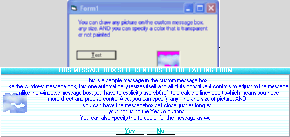



## Cutom MessageBox  with all the bell whistles and trimmings

### Description

yea yea I know..there are around a million messageboxes on planet. But i was building this one for my app and Im really partial to it and here is why. This does the same things the windows message box does but (1) you can have any size or type picture you want, and specify a transparent color (2) this message box will self close after any number of predefined seconds you specify (If the message box requires a response..ie YesNo messagebox this feature is disabled for obvious reasons) (3)This messagebox self centers vertically and horizontally in relation to its calling form. (4)This message box also responds to the shortcut keys so it can be interacted with the keyboard OR the mouse.

Take a look...i think you will like it now.
 
### More Info
 

             |
---                |---
**Submitted On**   |2005-02-14 03:59:06
**By**             |[Evan Toder](https://github.com/Planet-Source-Code/PSCIndex/blob/master/ByAuthor/evan-toder.md)
**Level**          |Intermediate
**User Rating**    |5.0 (15 globes from 3 users)
**Compatibility**  |VB 3\.0, VB 4\.0 \(16\-bit\), VB 4\.0 \(32\-bit\), VB 5\.0, VB 6\.0
**Category**       |[Custom Controls/ Forms/  Menus](https://github.com/Planet-Source-Code/PSCIndex/blob/master/ByCategory/custom-controls-forms-menus__1-4.md)
**World**          |[Visual Basic](https://github.com/Planet-Source-Code/PSCIndex/blob/master/ByWorld/visual-basic.md)
**Archive File**   |[Cutom\_Mess1852502142005\.zip](https://github.com/Planet-Source-Code/evan-toder-cutom-messagebox-with-all-the-bell-whistles-and-trimmings__1-58891/archive/master.zip)

